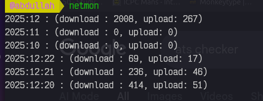

# Network Monitor
etwork Monitor is a command-line tool that monitors and displays network usage statistics for your system. It provides an easy way to check bandwidth consumption for all active network interfaces directly from the terminal.



## Installation Guide

### Prerequisites
- golang

``` bash
git clone https://github.com/abdoshbr3322/network_monitor.git
cd network_monitor
chmod +x ./install.sh
./install.sh
```

## Usage

``` bash
netmon
```